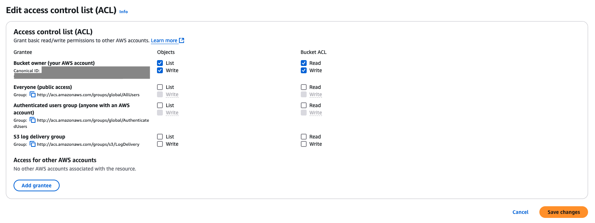

# S3 Bucket ACL Management Exercise

This guide demonstrates how to manage Access Control Lists (ACLs) for an AWS S3 bucket.

## Bucket Setup

### 1. Create a new bucket
```sh
aws s3api create-bucket \
    --bucket <BUCKET_NAME> \
    --create-bucket-configuration LocationConstraint=<REGION>
```

### 2. Configure public access settings
```sh
aws s3api put-public-access-block \
    --bucket <BUCKET_NAME> \
    --public-access-block-configuration '{
        "BlockPublicAcls": false,
        "IgnorePublicAcls": false,
        "BlockPublicPolicy": true,
        "RestrictPublicBuckets": true
    }'
```

### 3. Verify public access settings
```sh
aws s3api get-public-access-block --bucket <BUCKET_NAME>
```

Expected output:
```json
{
        "PublicAccessBlockConfiguration": {
                "BlockPublicAcls": false,
                "IgnorePublicAcls": false,
                "BlockPublicPolicy": true,
                "RestrictPublicBuckets": true
        }
}
```

## Managing Ownership and ACLs

### 1. Set bucket ownership controls
```sh
aws s3api put-bucket-ownership-controls \
    --bucket <BUCKET_NAME> \
    --ownership-controls '{"Rules":[{"ObjectOwnership":"BucketOwnerPreferred"}]}'
```

> After this step, ACLs become editable.



### 2. Set bucket-level ACL permissions
```sh
aws s3api put-bucket-acl \
    --bucket <BUCKET_NAME> \
    --grant-full-control id=[Your user canonical ID],id=[Recipient's canonical ID]
```

> **Important:** When using put-bucket-acl, it overwrites (not merges) the existing ACL. Always include your own canonical ID to preserve your access.

## Object-Level Access Control

To make files visible to another user, you must grant access at the object level in addition to bucket-level permissions:

```sh
aws s3api put-object \
    --bucket <BUCKET_NAME> \
    --key README.md \
    --body README.md \
    --grant-read id=[Recipient's canonical ID] \
    --grant-full-control id=[Your user canonical ID]
```

### Verifying access

The recipient can verify their access using:

```sh
aws s3api get-object \
    --bucket <BUCKET_NAME> \
    --key README.md \
    ./README.md
```

> **Note:** All files uploaded to the bucket are visible to the bucket owner, but for other users to access files, they need explicit object-level permissions.

# ACL (Access Control Lists)

Object Ownership controls how ACLs work. Important settings are:

- `BucketOwnerEnforced` (default)
- `BucketOwnerPreferred`
- `ObjectWriter`

## Check existing Bucket Public Access Block configuration

```bash
aws s3api create-bucket \
    --bucket <BUCKET_NAME> \
    --region <REGION>
```

## Check existing Block Public Access settings

```bash
aws s3api get-public-access-block \
    --bucket <BUCKET_NAME> \
    --region <REGION>
```

Example output:

```json
{
    "PublicAccessBlockConfiguration": {
        "BlockPublicAcls": true,
        "IgnorePublicAcls": true,
        "BlockPublicPolicy": true,
        "RestrictPublicBuckets": true
    }
}
```

```bash
aws s3api get-public-access-block --bucket <BUCKET_NAME>
```

## 1. Disable Block Public Access on Bucket Level

```bash
aws s3api delete-public-access-block \
    --bucket <BUCKET_NAME> \
    --region <REGION>
```

## 2. Set Object Ownership to allow ACLs

```bash
aws s3api put-bucket-ownership-controls \
    --bucket <BUCKET_NAME> \
    --ownership-controls '{"Rules":[{"ObjectOwnership":"BucketOwnerPreferred"}]}'
```

## 3. Apply ACLs - Make File Public Read

```bash
aws s3api put-object \
    --bucket <BUCKET_NAME> \
    --key hello.txt \
    --body hello.txt \
    --acl public-read
```

## 4. Apply ACLs - Make File Public Read-Write

```bash
aws s3api put-object \
    --bucket <BUCKET_NAME> \
    --key hello-public.txt \
    --body hello.txt \
    --acl public-read-write
```

## Check ACL

```bash
aws s3api get-object-acl \
    --bucket <BUCKET_NAME> \
    --key hello.txt
```