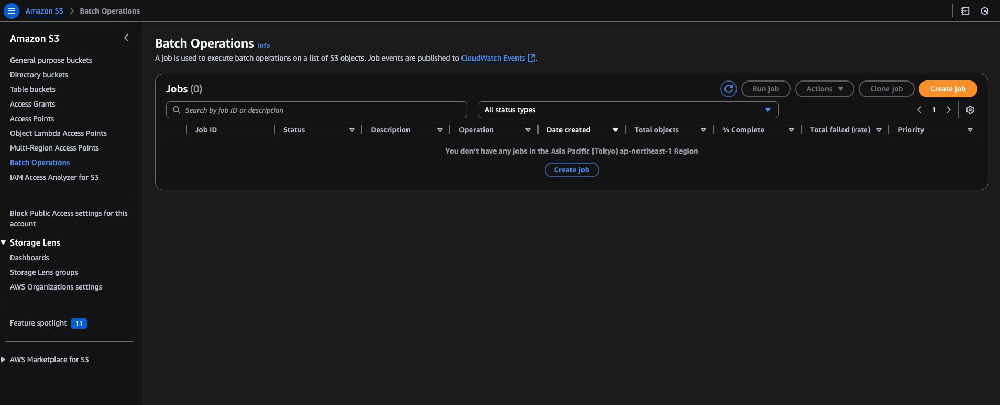
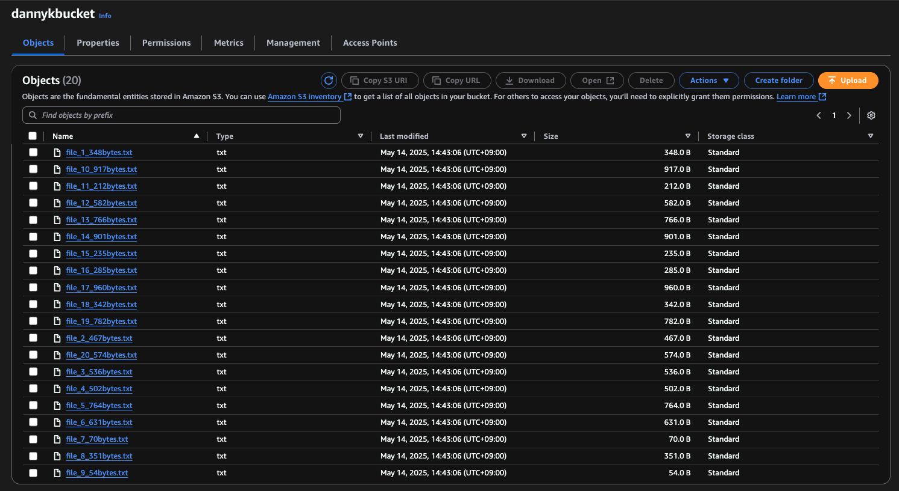

# S3 Batch Operations

This guide provides step-by-step instructions for performing batch operations on S3 buckets using AWS CLI and the AWS Management Console.

---

## Table of Contents

1. [Create a Bucket](#create-a-bucket)
2. [Create Random Files](#create-random-files)
3. [Sync Files to S3 Bucket](#sync-files-to-s3-bucket)
4. [Create a Manifest File](#create-a-manifest-file)
5. [Create a Replace Tag Job](#create-a-replace-tag-job)

---

## Create a Bucket

Run the following command to create a new S3 bucket:

```bash
aws s3 mb s3://dannykbucket
```

Go to the **Batch Operations** tab on the S3 Console to see how it looks:



Click on **Create Job** to proceed.

---

## Create Random Files

Run the following script to generate 20 random files with varying content sizes:

```bash
bash create-files.sh
```

This will create 20 files in the `files/` folder.

---

## Sync Files to S3 Bucket

Sync the generated files to the S3 bucket:

```bash
aws s3 sync files/ s3://dannykbucket
```



---

## Create a Manifest File

To create a manifest file for batch operations, ensure all files belong to the same bucket. Add the following content to `manifest.csv` in the `files/` folder:

```
dannykbucket,file_1_348bytes.txt
dannykbucket,file_2_467bytes.txt
dannykbucket,file_3_536bytes.txt
... (remaining files) ...
```

> **Note:** CSV does not require headers.

Sync the updated `manifest.csv` to the S3 bucket:

```bash
aws s3 sync files/ s3://dannykbucket
```

### Output:

```
upload: files/manifest.csv to s3://dannykbucket/manifest.csv
```

---

## Create a Replace Tag Job

1. Go to the S3 bucket on the AWS Console.
2. Click on the **Batch Operations** tab.
3. Click on **Create Job**.
4. Select the manifest file (`s3://dannykbucket/manifest.csv`).
5. Ensure all files in the manifest belong to the same bucket (`dannykbucket`).
6. Select the operation as **Replace Object Tags**.
7. Create an IAM Role with `S3FullAccess`. Use the role ARN: `arn:aws:iam::123456789012:role/BatchOperationsRole`.
8. Click on **Next**.
9. Review the job details and click on **Submit Job**.
10. Wait for the job to complete.
11. Check the job status in the **Batch Operations** tab.
12. Once the job is complete, you can check the tags of the files in the S3 bucket.
13. To verify the tags, you can use the following command:

```bash
aws s3api get-object-tagging --bucket dannykbucket --key file_1_348bytes.txt
```

Output

```json
{
  "TagSet": [
    {
      "Key": "hello",
      "Value": "world"
    }
  ]
}
```
