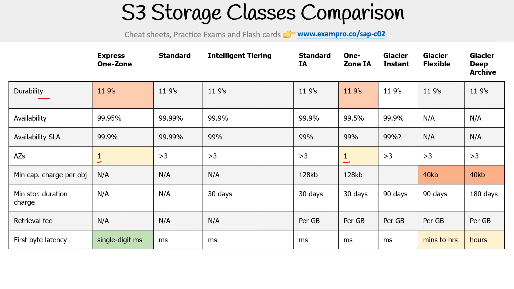

# Amazon S3 Storage Class Comparison

A detailed comparison of Amazon S3 storage classes, their costs, performance characteristics, and ideal use cases.

| Storage class               | Cost (US-East-1, $/GB-month)                      | Retrieval fee ($/GB)                       | First-byte latency                     | Availability SLA | Durability  | Min storage | Representative use-case                                                    |
|----------------------------|--------------------------------------------------|-------------------------------------------|----------------------------------------|------------------|-------------|--------------|-----------------------------------------------------------------------------|
| Standard                   | 0.023                                            | None                                      | Milliseconds                           | 99.99%           | 11 × 9s     | None         | High-traffic web content, data lakes, mobile-app assets                    |
| Intelligent-Tiering        | 0.023 frequent + 0.0025/1k-obj monitoring; 0.0125 infrequent; 0.004 archive instant | None for frequent/infrequent; archive tiers same as Glacier IR | Milliseconds                           | 99.9%            | 11 × 9s     | None (archive sub-tiers 90/180 days) | Long-lived data with unpredictable access, SaaS user uploads              |
| Standard-IA                | 0.0125                                           | 0.01                                      | Milliseconds                           | 99.9%            | 11 × 9s     | 30 days      | Disaster-recovery backups, infrequently read logs                          |
| One Zone-IA                | 0.010                                            | 0.01                                      | Milliseconds                           | 99.5%            | 11 × 9s*    | 30 days      | Re-creatable data like resized images or secondary copies                 |
| Glacier Instant Retrieval  | 0.004                                            | 0.03                                      | Milliseconds                           | 99.9%            | 11 × 9s     | 90 days      | PACS medical images, media archives needing instant pull                  |
| Glacier Flexible Retrieval | 0.0036                                           | Expedited 0.03 / Standard 0.01 / Bulk 0   | Expedited 1-5 min; Standard 3-5 h; Bulk 5-12 h | 99.99%           | 11 × 9s     | 90 days      | Long-term backups, compliance archives needing occasional restores        |
| Glacier Deep Archive       | 0.00099                                          | Standard ~0.02 / Bulk 0                   | 12-48 h                                | 99.99%           | 11 × 9s     | 180 days     | Regulatory retention (e.g., decade-old logs, film masters)                |
