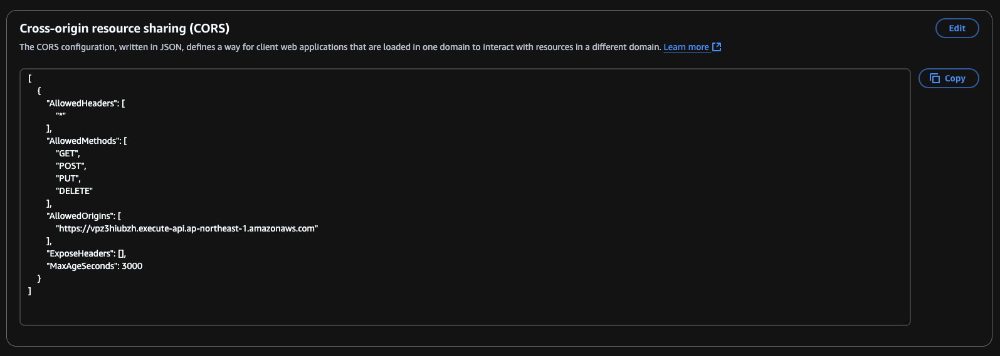

# S3 Static Website Hosting with Public Access and CORS Integration

This guide provides step-by-step instructions for hosting a static website on Amazon S3 with public access and CORS configuration to interact with an API Gateway endpoint.

---

## 1. Create the S3 Bucket

```sh
aws s3 mb s3://dannykbucket
```

---

## 2. Configure Public Access Settings

Enable public access through bucket policies (ACLs are blocked):

```sh
aws s3api put-public-access-block \
  --bucket dannykbucket \
  --public-access-block-configuration '{
    "BlockPublicAcls": true,
    "IgnorePublicAcls": true,
    "BlockPublicPolicy": false,
    "RestrictPublicBuckets": false
  }'
```

---

## 3. Attach a Bucket Policy

Grant public read access or scoped access via policy:

```sh
aws s3api put-bucket-policy \
  --bucket dannykbucket \
  --policy file://policy.json \
  --no-cli-auto-prompt
```

---

## 4. Enable Static Website Hosting

Set your index and error pages:

```sh
aws s3api put-bucket-website \
  --bucket dannykbucket \
  --website-configuration file://website.json
```

---

## 5. Verify Website Hosting

```sh
aws s3api get-bucket-website --bucket dannykbucket
```

---

## 6. Create and Preview `index.html` Locally

Preview locally using Python HTTP server:

```sh
python3 -m http.server 8000
# Visit http://localhost:8000/index.html
```

---

## 7. Upload Website Content

```sh
aws s3 cp index.html s3://dannykbucket
```

---

## 8. Access the Live Website

Visit:
```
http://dannykbucket.s3-website-ap-northeast-1.amazonaws.com
```

---

## 9. Test API Gateway Integration (CORS)

### API Endpoint (Mock):

```sh
curl -X POST https://vpz3hiubzh.execute-api.ap-northeast-1.amazonaws.com/prod/
```

Expected response:
```json
{ "message": "hello" }
```

---

## 10. Call the API from `index.html`

```html
<script>
fetch("https://vpz3hiubzh.execute-api.ap-northeast-1.amazonaws.com/prod/", {
    method: "POST"
})
.then(response => response.text())
.then(data => {
    console.log("API response:", data);
})
.catch(error => {
    console.error("API call failed:", error);
});
</script>
```

---

## 11. CORS Error (Expected)

If you see this error:

```
Access to fetch at ... has been blocked by CORS policy...
```

The fix involves setting up proper CORS headers in both S3 and API Gateway.

---

## 12. Configure CORS on S3 Bucket

### `cors.json`:

```json
{
  "CORSRules": [
    {
      "AllowedHeaders": ["*"],
      "AllowedMethods": ["GET", "POST", "PUT", "DELETE"],
      "AllowedOrigins": [
        "https://vpz3hiubzh.execute-api.ap-northeast-1.amazonaws.com"
      ],
      "ExposeHeaders": [],
      "MaxAgeSeconds": 3000
    }
  ]
}
```

### Apply CORS Configuration:

```sh
aws s3api put-bucket-cors \
  --bucket dannykbucket \
  --cors-configuration file://cors.json \
  --no-cli-auto-prompt
```

You can verify this in the **Permissions** tab of your S3 bucket:



---

## 13. Enable and Redeploy CORS in API Gateway

Enable CORS in API Gateway console and redeploy the stage. Once configured, requests from your S3 website to the API should succeed without CORS errors.