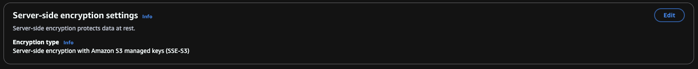
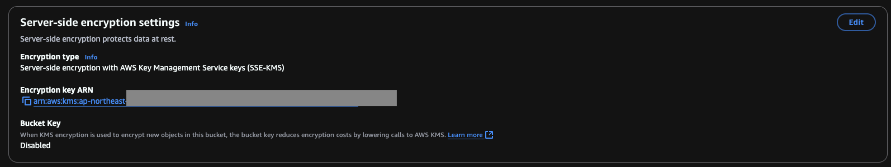
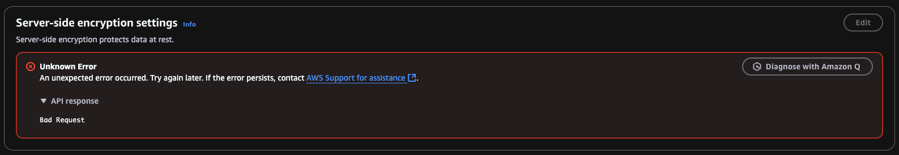

## Create and Upload a File to S3 with Encryption

This section demonstrates how to create an S3 bucket, upload a file with various server-side encryption options, and understand the different methods AWS provides for protecting data at rest.

---

### Step 1: Create the Bucket

```sh
aws s3 mb s3://dannykbucket
```

### Step 2: Create a Sample File

```sh
echo "Hello world" > hello.txt
```

### Step 3: Upload with Default Encryption (SSE-S3)

S3 automatically applies server-side encryption using S3-managed keys (SSE-S3) by default.

```sh
aws s3 cp hello.txt s3://dannykbucket
```

Result:


---

## Types of S3 Server-Side Encryption

### 1. SSE-S3 (S3 Managed Keys)
- Uses AES-256.
- Fully managed by AWS.
- Automatically enabled if no encryption option is specified.

```sh
aws s3 cp hello.txt s3://dannykbucket/sse-s3.txt
```

---

### 2. SSE-KMS (AWS KMS Managed Keys)
- Uses AWS KMS keys for encryption.
- Enables audit logging and fine-grained permissions.
- Requires specifying encryption mode and optionally a KMS key.

```sh
aws s3 cp hello.txt s3://dannykbucket/sse-kms.txt --sse aws:kms
```

Or use the low-level API with a specific KMS key:

```sh
aws s3api put-object \
  --bucket dannykbucket \
  --key hello-sse-kms.txt \
  --body hello.txt \
  --server-side-encryption aws:kms \
  --ssekms-key-id YOUR_KMS_KEY_ID  # Replace with your actual KMS key ID
```

Result:


---

### 3. SSE-C (Customer-Provided Keys)
- You manage your own encryption key.
- AWS does not store the key.
- Used for compliance-controlled environments.
- Not accessible via AWS Console (you'll see a decryption error).

> ⚠️ Your key must be a 32-byte raw binary value, base64-encoded.

#### Step 1: Generate Key and MD5 Hash

```sh
openssl rand 32 > key.bin
base64 key.bin > key.b64
openssl md5 -binary key.bin | base64 > key-md5.b64
```

#### Step 2: Assign to Variables

```sh
KEY=$(tr -d '\n\r ' < key.b64)
KEY_MD5=$(tr -d '\n\r ' < key-md5.b64)
```

#### Step 3: Upload Using SSE-C

```sh
aws s3api put-object \
  --bucket dannykbucket \
  --key sse-c.txt \
  --body hello.txt \
  --sse-customer-algorithm AES256 \
  --sse-customer-key "$KEY" \
  --sse-customer-key-md5 "$KEY_MD5"
```

Sample output:

```json
{
    "ETag": "\"114261d66b90d86b693f6d8346ccdc52\"",
    "ChecksumCRC64NVME": "n1r0eVF9tCA=",
    "ChecksumType": "FULL_OBJECT",
    "SSECustomerAlgorithm": "AES256",
    "SSECustomerKeyMD5": "fpbkHMBYCJwd/vWBSWKwmg=="
}
```

#### Step 4: Retrieve Object

```sh
aws s3api get-object \
  --bucket dannykbucket \
  --key sse-c.txt \
  --sse-customer-algorithm AES256 \
  --sse-customer-key "$KEY" \
  --sse-customer-key-md5 "$KEY_MD5" \
  sse-c-downloaded.txt
```

Console Warning (Expected):
> AWS Console cannot decrypt SSE-C objects.
> 

---

### 4. DSSE-KMS (Dual-layer Encryption with KMS)
- Encrypts data with two independent AWS KMS keys.
- Meets stricter compliance/security requirements.
- Bucket must be explicitly configured for DSSE-KMS.

---

### 5. Client-Side Encryption
- You encrypt files before uploading to S3.
- Full control over keys and lifecycle.
- Requires SDKs or external tooling (not shown here).
