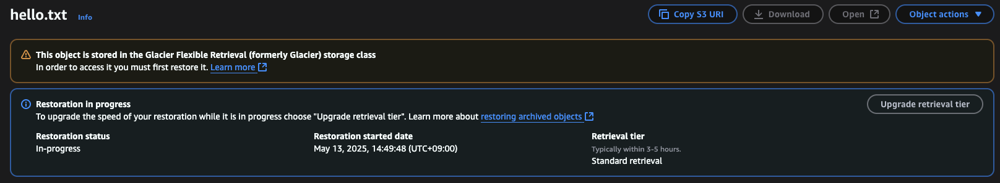
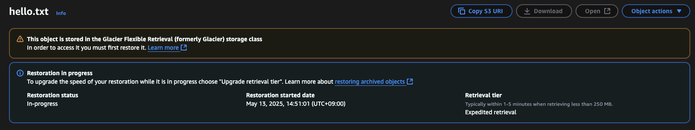
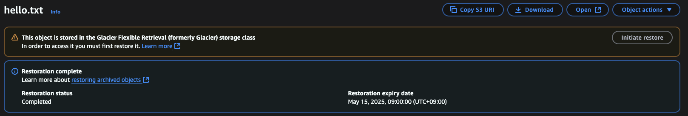

# Working with S3 Glacier Storage

This guide explains how to use Amazon S3 Glacier storage class for storing and retrieving objects. Screenshots from the AWS Console are included for reference.

---

## Step 1: Navigate to the Glacier Folder

Move to the `s3/glacier` folder in your project:

```bash
cd s3/glacier
```

---

## Step 2: Create an S3 Bucket

Create a new S3 bucket named `<BUCKET_NAME>`:

```bash
aws s3 mb s3://<BUCKET_NAME>
```

---

## Step 3: Upload a File to Glacier Storage

Create a file and upload it to the bucket with the Glacier storage class:

```bash
echo 'Hello, World!' > hello.txt
aws s3 cp hello.txt s3://<BUCKET_NAME> --storage-class GLACIER
```

> **Note:** Files stored in S3 Glacier are not immediately accessible. You need to restore them before downloading.

---

## Step 4: Attempt to Download the File

Try downloading the file from the bucket:

```bash
aws s3 cp s3://<BUCKET_NAME>/hello.txt hello.txt
```

### Output:

```
warning: Skipping file s3://<BUCKET_NAME>/hello.txt. Object is of storage class GLACIER. Unable to perform download operations on GLACIER objects. You must restore the object to be able to perform the operation. See aws s3 download help for additional parameter options to ignore or force these transfers.
```

---

## Step 5: Restore the File

Initiate a restore request for the file:

```bash
aws s3api restore-object --bucket <BUCKET_NAME> --key hello.txt --restore-request Days=1
```

> **Note:** The standard tier takes 3-5 hours to restore.

### Screenshot:



---

## Step 6: Check the Restoration Status

Check the status of the restoration:

```bash
aws s3api head-object --bucket <BUCKET_NAME> --key hello.txt
```

### Output:

```json
{
  "AcceptRanges": "bytes",
  "Restore": "ongoing-request=\"true\"",
  "LastModified": "2025-05-13T05:48:42+00:00",
  "ContentLength": 14,
  "ETag": "\"bea8252ff4e80f41719ea13cdf007273\"",
  "ContentType": "text/plain",
  "ServerSideEncryption": "AES256",
  "Metadata": {},
  "StorageClass": "GLACIER"
}
```

---

## Step 7: Expedite the Restoration

Use the expedited tier to restore the file faster (1-5 minutes):

```bash
aws s3api restore-object --bucket <BUCKET_NAME> --key hello.txt --restore-request Days=1,GlacierJobParameters={Tier=Expedited}
```

### Screenshot:



---

## Step 8: Verify and Download the Restored File

Once the file is restored, download it:

```bash
aws s3 cp s3://<BUCKET_NAME>/hello.txt hello_restored.txt
```

### Output:

```
File downloaded successfully.
```

### Screenshot:



> **It works!**
