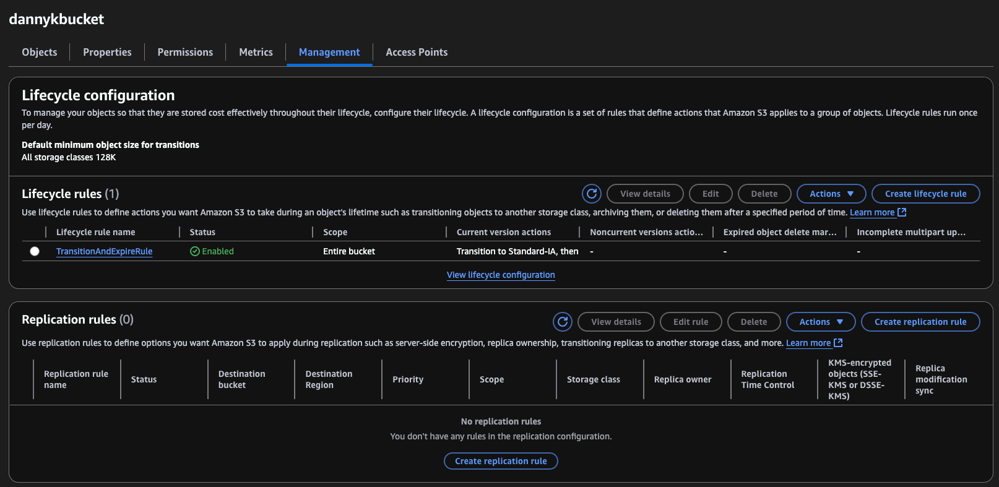

# Create a lifecycle policy for S3 bucket

Move to project folder:

```bash
cd s3/lifecycle
```

## Create S3 bucket

Create a new S3 bucket named 'dannykbucket':

```bash
aws s3 mb s3://dannykbucket
```

## Configure lifecycle policy

1. Create a JSON file with lifecycle rules:

```bash
echo '{
    "Rules": [
        {
            "ID": "TransitionAndExpireRule",
            "Status": "Enabled",
            "Filter": {
                "Prefix": ""
            },
            "Transitions": [
                {
                    "Days": 30,
                    "StorageClass": "STANDARD_IA"
                },
                {
                    "Days": 90,
                    "StorageClass": "GLACIER"
                }
            ],
            "Expiration": {
                "Days": 365
            }
        }
    ]
}' > lifecycle.json
```

2. Apply the lifecycle policy to the bucket:

```bash
aws s3api put-bucket-lifecycle-configuration --bucket dannykbucket --lifecycle-configuration file://lifecycle.json
```

This policy will:

- Move objects to STANDARD_IA after 30 days
- Move objects to GLACIER after 90 days
- Delete objects after 365 days

## Response

```json
{
  "TransitionDefaultMinimumObjectSize": "all_storage_classes_128K"
}
```

## Verify lifecycle policy

Check the lifecycle policy configuration:

```bash
aws s3api get-bucket-lifecycle-configuration --bucket dannykbucket
```

## Response

```json
{
  "TransitionDefaultMinimumObjectSize": "all_storage_classes_128K",
  "Rules": [
    {
      "Expiration": {
        "Days": 365
      },
      "ID": "TransitionAndExpireRule",
      "Filter": {
        "Prefix": ""
      },
      "Status": "Enabled",
      "Transitions": [
        {
          "Days": 30,
          "StorageClass": "STANDARD_IA"
        },
        {
          "Days": 90,
          "StorageClass": "GLACIER"
        }
      ]
    }
  ]
}
```

## Verify on AWS Console



## Clean up

To delete the bucket and its contents:

```bash
aws s3 rb s3://dannykbucket --force
```

> Note: The minimum storage duration for STANDARD_IA is 30 days, and for GLACIER is 90 days. You'll be charged for the minimum duration even if you delete objects earlier.
