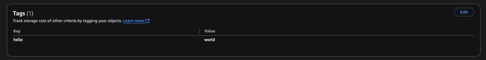

# Managing Object Tags in Amazon S3 Buckets

This guide demonstrates how to manage object tags in Amazon S3 using AWS CLI commands.

## Prerequisites

- AWS CLI installed and configured
- Access to AWS S3

## Steps

### 1. Create a bucket

First, create a bucket using the `mb` command:

```bash
aws s3 mb s3://<BUCKET_NAME>
```

### 2. Create and Upload a File

```bash
echo 'Hello, World!' > hello.txt
aws s3 cp hello.txt s3://<BUCKET_NAME>
```

### 3. Apply Object Tags

Use the `put-object-tagging` command to add tags:

```bash
aws s3api put-object-tagging \
    --bucket <BUCKET_NAME> \
    --key hello.txt \
    --tagging 'TagSet=[{Key=hello,Value=world}]'
```

This adds a tag with key "hello" and value "world" to the object.

### 4. Verify Tags

#### Visual Verification



#### Programmatic Verification

Use the `get-object-tagging` command:

```bash
aws s3api get-object-tagging \
    --bucket <BUCKET_NAME> \
    --key hello.txt
```

Example output:

```json
{
  "TagSet": [
    {
      "Key": "hello",
      "Value": "world"
    }
  ]
}
```
