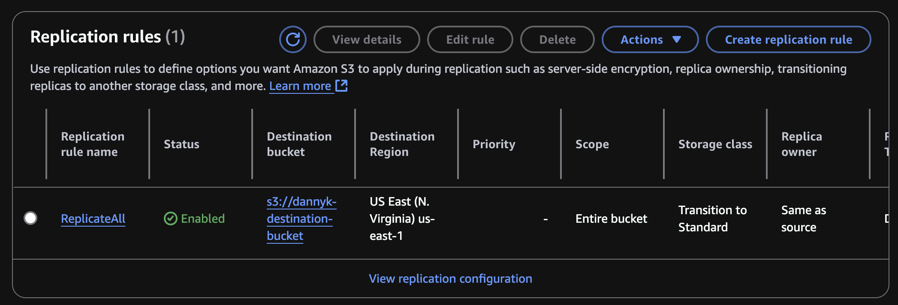

# S3 Cross-Region Replication Setup

This guide demonstrates how to set up cross-region replication between two S3 buckets.

## Setup Steps

### 1. Create Source and Destination Buckets

```bash
# Create source bucket (default region)
aws s3 mb s3://dannyk-source-bucket

# Create destination bucket in us-east-1
aws s3 mb s3://dannyk-destination-bucket --region us-east-1
```

### 2. Enable Versioning

```bash
# Enable versioning on both buckets
aws s3api put-bucket-versioning \
    --bucket dannyk-source-bucket \
    --versioning-configuration Status=Enabled

aws s3api put-bucket-versioning \
    --bucket dannyk-destination-bucket \
    --versioning-configuration Status=Enabled
```

### 3. Set Up IAM Role and Policy

```bash
# Create IAM Policy
aws iam create-policy \
    --policy-name dannyk-s3-replication-policy \
    --policy-document file://policy.json

# Create IAM Role
aws iam create-role \
    --role-name dannyk-s3-replication-role \
    --assume-role-policy-document file://trust.json

# Attach Policy to Role
aws iam attach-role-policy \
    --role-name dannyk-s3-replication-role \
    --policy-arn arn:aws:iam::<account-id>:policy/dannyk-s3-replication-policy
```

### 4. Configure Replication

```bash
aws s3api put-bucket-replication \
    --bucket dannyk-source-bucket \
    --replication-configuration file://replication.json
```

Verify in AWS Console: Source bucket > Management tab > Replication rules


### 5. Test Replication

```bash
# Create and upload test file
echo "test" > test.txt
aws s3 cp test.txt s3://dannyk-source-bucket/test.txt

# Verify in destination bucket
aws s3 ls s3://dannyk-destination-bucket
```

The file should appear in the destination bucket after a few moments.

## Troubleshooting

- Ensure both buckets have versioning enabled
- Verify the IAM role has the correct permissions
- Check that the replication configuration is properly formatted
- Allow some time for replication to occur (usually within minutes)
